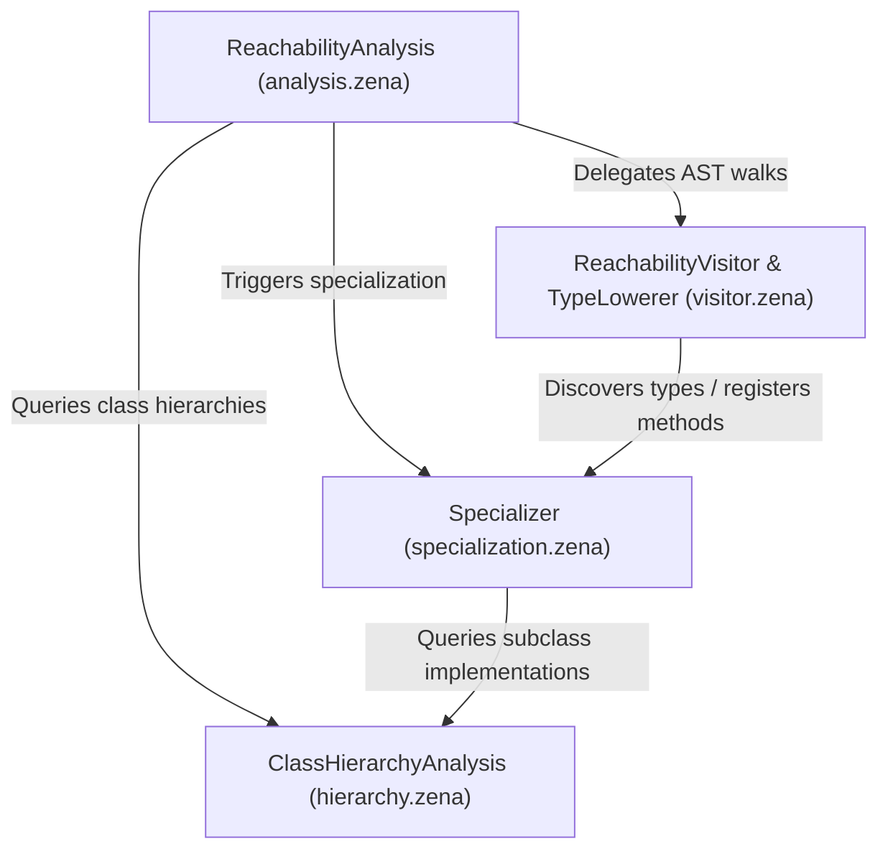

# Reachability Analysis & Codegen Specialization (RTA)

This directory implements the whole-program reachability analysis and monomorphization/specialization pass for the Zena self-hosted compiler.

## Design Overview

In WebAssembly GC, having concrete struct and vtable definitions is required before code generation. To minimize the compiled code size and Wasm type section complexity, Zena utilizes a whole-program reachability analysis that performs **Rapid Type Analysis (RTA)**.

Instead of generating structures and function signatures for every class/interface or generic overload, the reachability pass starts at entry point roots (e.g. `main` or exports) and iteratively traverses reached functions and types. As new instantiations (`new Point()`) and dynamic dispatches are encountered, the pass resolves implementing virtual method overloads and queues them for traversal.

## Component Subsystems

To keep the codebase maintainable and maintain low AST traversal overhead, the reachability analysis is broken down into four cooperating modules:



### 1. Central Coordinator: `ReachabilityAnalysis` (`analysis.zena`)

- Main entry point that manages RTA traversal queues (`reachableQueue`, `checkableQueue`).
- Configures and instantiates the helper subsystems in its constructor.
- Coordinates the overall compilation passes:
  - Pre-registers declared types to handle circular definitions.
  - Walks traversed functions iteratively until no new reachable symbols/methods are found.
  - Performs structural linker steps like linking base class vtables and resolving property getters/setters.

### 2. AST Visitor & Type Lowerer: `ReachabilityVisitor` & `TypeLowerer` (`visitor.zena`)

- **`ReachabilityVisitor`**: Traverses reached function and method bodies, discovering global dependencies, closures, and interface usage, and queues any newly referenced virtual members.
- **`TypeLowerer`**: Resolves structural types (`RecordType`, `TupleType`, etc.), array classes, and class/interface types to concrete WebAssembly types.

### 3. Monomorphizer: `Specializer` (`specialization.zena`)

- Performs generic class and interface specialization.
- Maintains lists of instantiated classes. When a generic class is instantiated, it generates specialized vtables, structs, and physical methods corresponding to that concrete type argument combination.
- Instantiates specialized generic function signatures.

### 4. Class Hierarchy Analysis: `ClassHierarchyAnalysis` (`hierarchy.zena`)

- Manages caches for subclass relationships (`isSubclassOf`).
- Resolves dynamic overrides, locating the concrete `MethodDefinition`, `AccessorDeclaration`, or `FieldDefinition` that implements a virtual slot on a subclass.
- Collects implementing interfaces transitively.

## Code Generation Pipeline Integration

The reachability pass is run in [module-generator.zena](../module-generator.zena):

```zena
let pass = new ReachabilityAnalysis(this.program, wasm, this.target);
pass.run();
```

After `pass.run()`, the `WasmModule` contains exactly the functions, struct layouts, and vtable allocations that are actually reached during execution, drastically reducing the Wasm module size.
